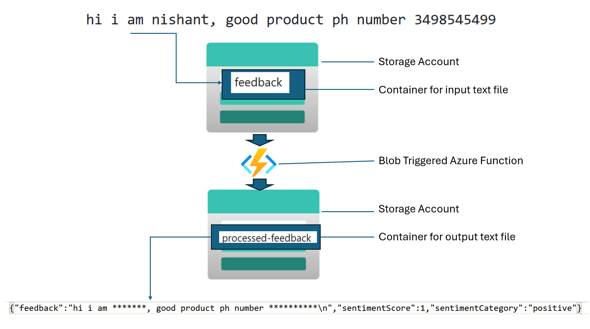

# Real World AI use case : Enhancing Customer Feedback Management with Azure AI 

## Introduction

Contoso, a leading retail company, is facing challenges in managing and analyzing customer feedback. The current system is manual, time-consuming, and lacks the ability to efficiently process large volumes of feedback. This results in delayed responses to customer concerns and missed opportunities for improving customer satisfaction.

## Requirements

- Familiar with Azure 
- Familiar with the basics of Azure AI Service
- Familiar with Azure Function

## Learning Objectives

This hack will help you learn:

- Understand Azure AI Services: Gain a comprehensive understanding of Azure AI capabilities, including PII detection and sentiment analysis.
- Implement Azure Functions: Learn how to create and deploy Azure Functions to process customer feedback.
- Data Storage and Analysis: Understand how to store processed feedback in Azure Storage Account.

## **Success Criteria:**
- You should be able to remove PII and get the sentiment score (using Azure Function) and able to save the sanitized feedback with score in a different container("processed-feedback") of the storage account

---
### **Challenges:**

#### **Challenge 1: Setting Up the Foundation**
- Create an Azure Function App (use Consumption plan & OS as windows).
- Create an Azure AI service for PII (Personally Identifiable Information) detection and sentiment analysis.
- Set up a Storage Account to handle input and output data. You have to create a storage account with two containers a)feedback b)processed-feedback (feedback: where you will upload the text file (containing customer feedback),  processed-feedback: will receive the processed feedback from Azure function)

**Goal:** Participants will demonstrate proficiency in configuring Azure resources to form the backbone of the automation pipeline.

---

#### **Challenge 2: Implementing the Blob-Triggered Function**
- Write a Node.js function that gets triggered whenever a new file is uploaded to the blob storage container("feedback" one you created earlier).
- Ensure the function is configured correctly to process the uploaded file.

**Goal:** Participants will show their ability to integrate Azure Function Apps with Blob Storage for data-driven event handling.

---

#### **Challenge 3: Processing and Transforming Feedback**
- Enhance the Azure Function to:
  - Receive the input file from Blob Storage.(You can upload the text.txt file in the repo (under infra folder) to the "	feedback" container)
  - Use the Azure AI service to analyze feedback for sentiment and detect PII.
  - Redact any PII from the data.
- Output the sanitized and analyzed results into a "processed-feedback" container.

**Goal:** Participants will exhibit skills in using Azure AI services and designing effective data pipelines.
  
#### Resources

- [**PII Detection**](https://learn.microsoft.com/en-us/azure/ai-services/language-service/personally-identifiable-information/quickstart?tabs=windows&pivots=programming-language-python)
- [**Sentiment analysis**](https://learn.microsoft.com/en-us/azure/synapse-analytics/machine-learning/tutorial-cognitive-services-sentiment)
- [**Azure Function**](https://learn.microsoft.com/en-us/azure/azure-functions/functions-get-started?pivots=programming-language-python)

